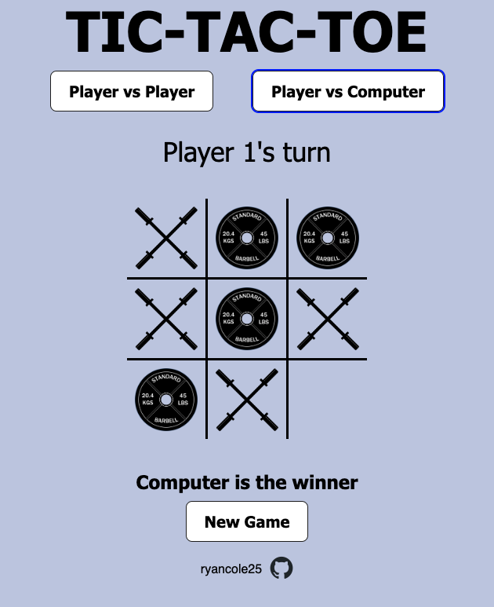

# Tic-Tac-Toe

This is my version of Tic-Tac-Toe for the Odin project. You can either play against another player or choose to play against the unbeatable computer (you can try to prove me wrong). I added my own flare on the shapes of tic-tac-toe by making the Xs barbells and the Os weight plates.

In this project, I used the minimax algorithm to make an unbeatable computer. In short, the computer simulates all possible moves it can make and chooses the one that maximizes its own chance of winning, while minimizing your chance of winning. This was my first exposure to using algorithms like this to make smart opponents, so it took a lot of effort to really figure out how to actually implement it in my game.

[Live Preview](https://ryancole25.github.io/Tic-Tac-Toe)

Here is a screenshot of the site:

